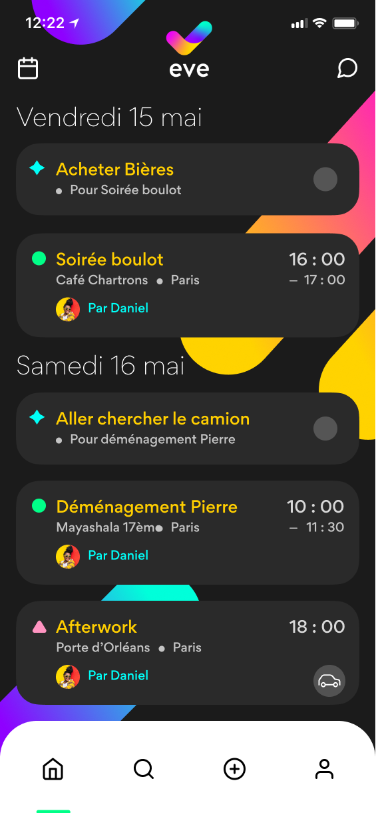

# Technical test for Buddy Buddy company

## guideline 

integrated this model in React Native in 1 week maximum

## result

### features

- All components are built in full functional component with hooks
- Full integration with [Typescript](https://www.typescriptlang.org/)
- All styles are managed in [Styled-components](https://styled-components.com/)
- Using Firebase to store events / todos and users of the application with [Firestore database](https://firebase.google.com/products/firestore)
- Using Firebase to store users photos with [Firebase Storage](https://firebase.google.com/products/storage)
- Using [momentjs](https://momentjs.com/) to manage dates
- Using [lodash](https://lodash.com/) to tricky methods
- Using [Jest](https://jestjs.io/) for unit tests on methods in the Tools folder
